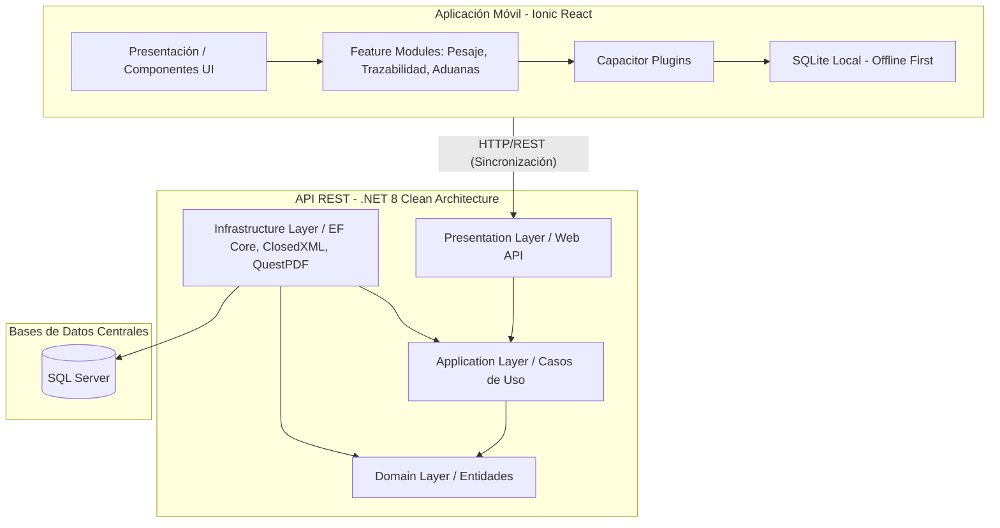

# Arquitectura del Sistema

```mermaid
graph TD
    subgraph Frontend [Aplicación Móvil - Ionic React]
        UI[Presentación / Componentes UI]
        Features[Feature Modules: Pesaje, Trazabilidad, Aduanas]
        Capacitor[Capacitor Plugins]
        SQLite[SQLite Local - Offline First]
        UI --> Features
        Features --> Capacitor
        Capacitor --> SQLite
    end

    subgraph Backend [API REST - .NET 8 Clean Architecture]
        API[Presentation Layer / Web API]
        App[Application Layer / Casos de Uso]
        Domain[Domain Layer / Entidades]
        Infra[Infrastructure Layer / EF Core, ClosedXML, QuestPDF]
        
        API --> App
        App --> Domain
        Infra --> App
        Infra --> Domain
    end
    
    subgraph Storage [Bases de Datos Centrales]
        SQLServer[(SQL Server)]
    end
    
    Frontend -- "HTTP/REST (Sincronización)" --> API
    Infra --> SQLServer
```
