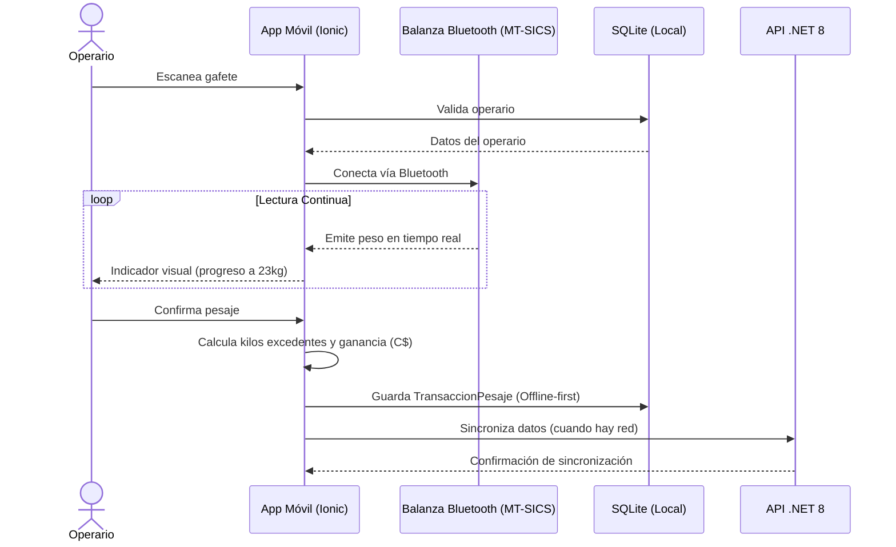

# Flujo de Usuario - Pesaje de Plátano

```mermaid
sequenceDiagram
    actor Operario
    participant IonicApp as App Móvil (Ionic)
    participant Balanza as Balanza Bluetooth (MT-SICS)
    participant LocalDB as SQLite (Local)
    participant Backend as API .NET 8
    
    Operario->>IonicApp: Escanea gafete
    IonicApp->>LocalDB: Valida operario
    LocalDB-->>IonicApp: Datos del operario
    IonicApp->>Balanza: Conecta vía Bluetooth
    loop Lectura Continua
        Balanza-->>IonicApp: Emite peso en tiempo real
        IonicApp-->>Operario: Indicador visual (progreso a 23kg)
    end
    Operario->>IonicApp: Confirma pesaje
    IonicApp->>IonicApp: Calcula kilos excedentes y ganancia (C$)
    IonicApp->>LocalDB: Guarda TransaccionPesaje (Offline-first)
    IonicApp->>Backend: Sincroniza datos (cuando hay red)
    Backend-->>IonicApp: Confirmación de sincronización
```
