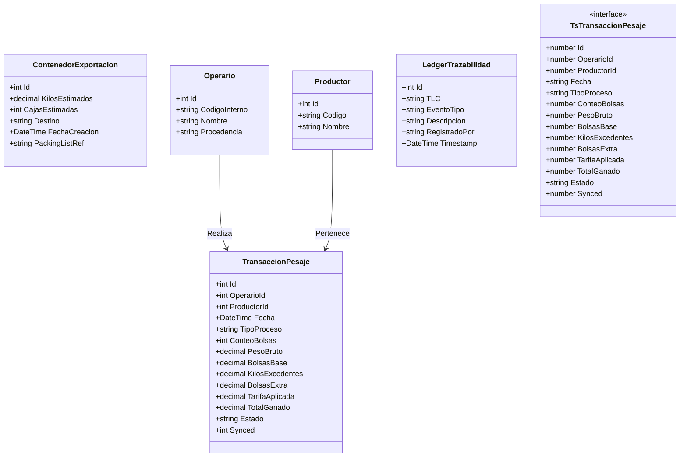

# Diagrama de Clases (Dominio)

Representación de la estructura de las clases principales dentro del Clean Architecture (.NET) y los modelos de TypeScript en el Frontend.

```mermaid
classDiagram
    class ContenedorExportacion {
        +int Id
        +decimal KilosEstimados
        +int CajasEstimadas
        +string Destino
        +DateTime FechaCreacion
        +string PackingListRef
    }

    class Operario {
        +int Id
        +string CodigoInterno
        +string Nombre
        +string Procedencia
    }
    
    class Productor {
        +int Id
        +string Codigo
        +string Nombre
    }

    class TransaccionPesaje {
        +int Id
        +int OperarioId
        +int ProductorId
        +DateTime Fecha
        +string TipoProceso
        +int ConteoBolsas
        +decimal PesoBruto
        +decimal BolsasBase
        +decimal KilosExcedentes
        +decimal BolsasExtra
        +decimal TarifaAplicada
        +decimal TotalGanado
        +string Estado
        +int Synced
    }
    
    class LedgerTrazabilidad {
        +int Id
        +string TLC
        +string EventoTipo
        +string Descripcion
        +string RegistradoPor
        +DateTime Timestamp
    }

    class TsTransaccionPesaje {
        <<interface>>
        +number Id
        +number OperarioId
        +number ProductorId
        +string Fecha
        +string TipoProceso
        +number ConteoBolsas
        +number PesoBruto
        +number BolsasBase
        +number KilosExcedentes
        +number BolsasExtra
        +number TarifaAplicada
        +number TotalGanado
        +string Estado
        +number Synced
    }

    Operario --> TransaccionPesaje : Realiza
    Productor --> TransaccionPesaje : Pertenece
```
