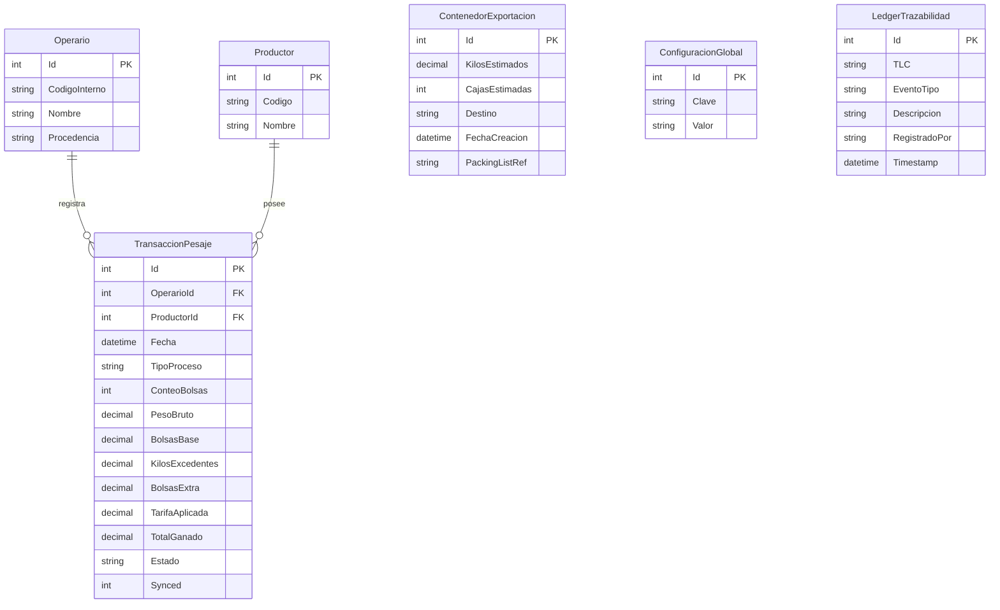

# Diagrama de Entidad-Relación (ERD)

Este diagrama muestra cómo se relacionan las tablas principales en la base de datos local SQLite para asegurar la trazabilidad.

```mermaid
erDiagram
    Operario {
        int Id PK
        string CodigoInterno
        string Nombre
        string Procedencia
    }
    
    Productor {
        int Id PK
        string Codigo
        string Nombre
    }

    TransaccionPesaje {
        int Id PK
        int OperarioId FK
        int ProductorId FK
        datetime Fecha
        string TipoProceso
        int ConteoBolsas
        decimal PesoBruto
        decimal BolsasBase
        decimal KilosExcedentes
        decimal BolsasExtra
        decimal TarifaAplicada
        decimal TotalGanado
        string Estado
        int Synced
    }
    
    ContenedorExportacion {
        int Id PK
        decimal KilosEstimados
        int CajasEstimadas
        string Destino
        datetime FechaCreacion
        string PackingListRef
    }
    
    ConfiguracionGlobal {
        int Id PK
        string Clave
        string Valor
    }

    LedgerTrazabilidad {
        int Id PK
        string TLC
        string EventoTipo
        string Descripcion
        string RegistradoPor
        datetime Timestamp
    }
    
    Operario ||--o{ TransaccionPesaje : "registra"
    Productor ||--o{ TransaccionPesaje : "posee"
```
