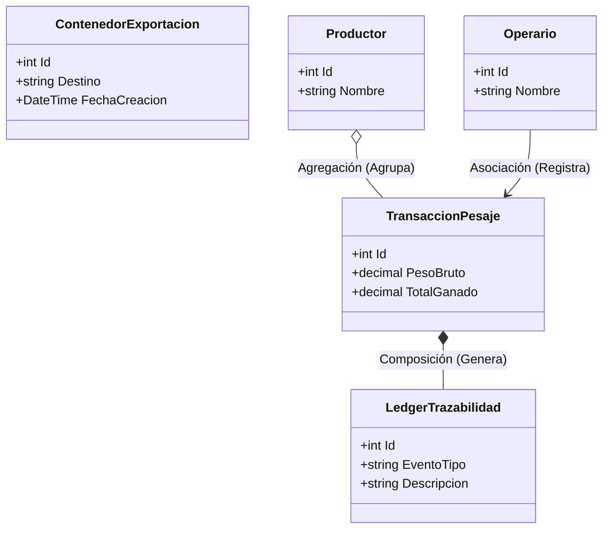
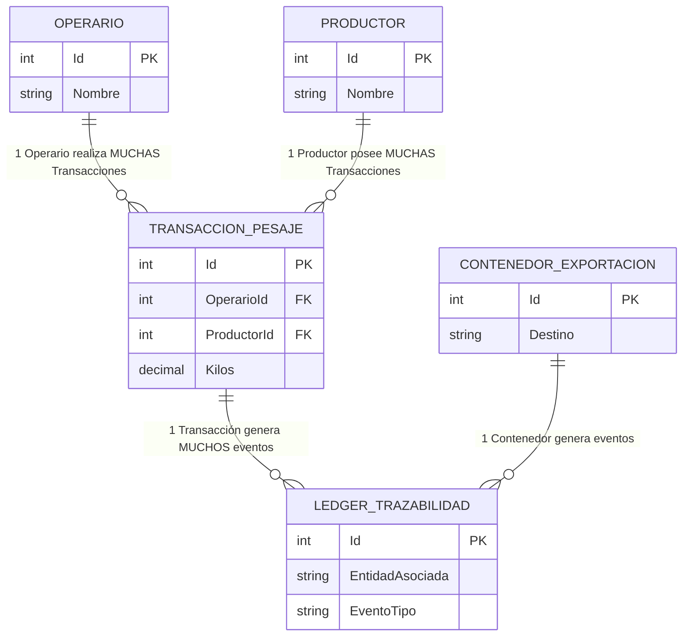

# 🏗️ Diagramas de Relaciones (Agregación, Composición y Asociación)

A continuación, te presento los diagramas actualizados enfocados específicamente en explicar **cómo se relacionan las entidades** dentro del sistema AgroTrack, utilizando la notación UML formal para indicar si la relación es una dependencia débil (Agregación) o una dependencia fuerte (Composición).

---

## 1. Diagrama de Clases (Relaciones UML)

En UML (Lenguaje Unificado de Modelado), las flechas determinan el tipo de relación de la siguiente manera:
- `*--` **(Composición):** Relación "Parte de" **fuerte**. Si se elimina el padre, las partes dejan de tener sentido y también se eliminan.
- `o--` **(Agregación):** Relación "Tiene un" **débil**. Las partes pueden existir independientemente del contenedor.
- `-->` **(Asociación):** Relación "Usa a" o "Realiza". Simplemente indica interacción o conocimiento entre clases.

### 🧠 Explicación de Relaciones de Clase:
1. **Composición (`TransaccionPesaje` *-- `LedgerTrazabilidad`):** Cada pesaje u operación genera un evento inmutable (Ledger) para cumplir con FSMA 204. Si la transacción principal desapareciera, sus eventos de auditoría quedarían huérfanos y sin sentido. Por lo tanto, el Ledger le pertenece estrictamente a su transacción (o al contenedor).
2. **Agregación (`Productor` o-- `TransaccionPesaje`):** Un Productor "tiene" muchas transacciones de pesaje (sus racimos entregados). Sin embargo, si un Productor deja de ser proveedor y se archiva en el sistema, las transacciones de pesaje históricas **deben seguir existiendo** de forma independiente para el historial contable (ciclo de vida independiente).
3. **Asociación (`Operario` --> `TransaccionPesaje`):** El Operario "realiza" o "firma" el pesaje. Es una asociación directa porque el operario es el actor que ejecuta la acción, pero no contiene físicamente a la transacción ni la transacción lo contiene a él.

---

## 2. Diagrama de Entidad-Relación (Base de Datos Real - SQLite)

### 🧠 Explicación de Multiplicidad (ERD):
*   `||--o{` : Significa **"Cero o Muchos"**. Ejemplo: Un `Productor` (1) puede estar registrado pero tener (0) transacciones, o tener muchísimas (N) transacciones de pesaje.
*   `||--|{` : Significa **"Uno o Muchos"**. Ejemplo: Para que exista un `CONTENEDOR_EXPORTACION` válido en el sistema de aduanas, por regla de negocio debe tener al menos un (1) `LOTE_EMPAQUE` en su interior, de lo contrario es un contenedor vacío y no se despacha.
*   **Llaves Foráneas (FK):** Las tablas `TRANSACCION_PESAJE`, `LOTE_EMPAQUE` y `LEDGER_TRAZABILIDAD` son tablas dependientes (tablas hijas). No pueden existir si no tienen un `Id` válido que las vincule con un padre (Operario, Productor, o Contenedor).
